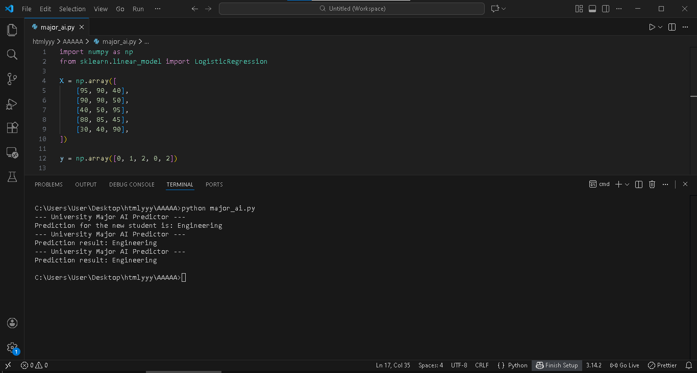

# Student Career Path Predictor (AI Model)

### Project Overview
This project is a functional Machine Learning model designed to predict the most suitable university major for students based on their academic performance across different subjects. It serves as a practical implementation of core Artificial Intelligence and data science principles.

### Academic Foundation
The model is built using the Logistic Regression algorithm, a cornerstone of classification techniques taught in world-class AI programs like Stanford University's CS229. This project successfully bridges the gap between theoretical math and practical Python programming.

### Technical Stack and Dependencies
* Language: Python.
* NumPy: Used for high-performance matrix operations and data organization.
* Scikit-learn: Utilized for building, training, and executing the Logistic Regression model.
* Joblib and Scipy: Managed as core dependencies for model optimization and execution.

### Methodology
1. Data Representation: Academic scores are structured as a feature matrix X, while university majors are encoded as target labels y.
2. Model Training: The model.fit(X, y) process enables the AI to learn specific patterns correlating grades with academic paths.
3. Inference: The model takes new student data and accurately classifies them into a specific major (e.g., Engineering, Medicine, or Arts).

### Execution Result
As shown in the implementation screenshot, the model successfully processed a new student profile and predicted the Engineering path based on the learned logic.

